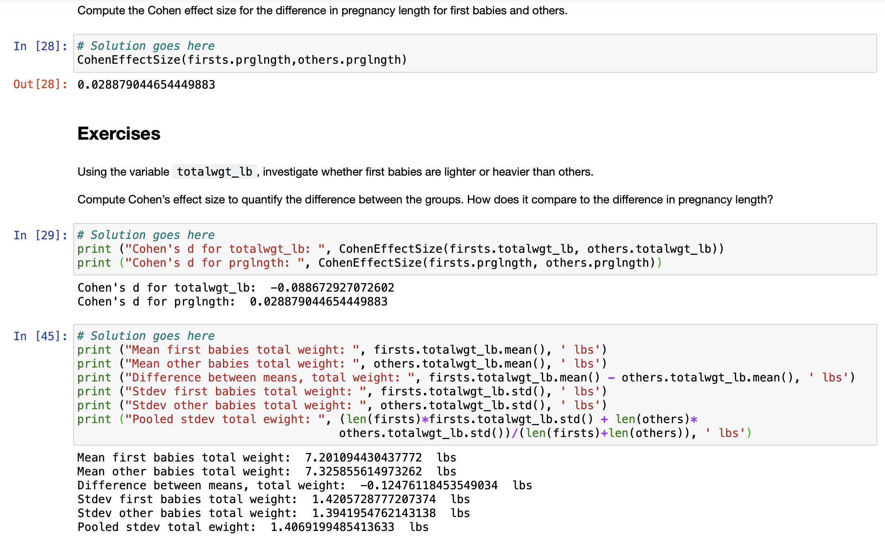

[Think Stats Chapter 2 Exercise 4](http://greenteapress.com/thinkstats2/html/thinkstats2003.html#toc24) (Cohen's d)

Cohen's d between firstborns and all other babies for birth weight in lbs is computed using
`CohenEffectSize(firsts.totalwgt_lb, others.totalwgt_lb)`, which takes the difference in means
between the two groups and divides it by their variance.

We get a Cohen's d of `-0.089`, which suggests a very small effect size difference between the
two groups for birth weight. Looking at the means for both groups using `.mean()`, we can confirm
that our result makes sense.

Using the same methods, we find the Cohen's d for pregnancy length between the two groups to be
`0.029`. This also suggests a very small effect size difference between the two groups for
length of pregnancy.

