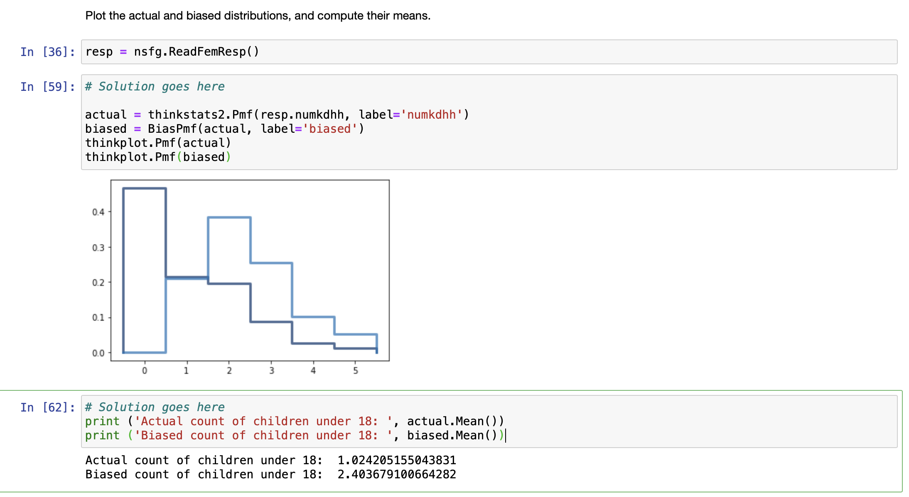

[Think Stats Chapter 3 Exercise 1](http://greenteapress.com/thinkstats2/html/thinkstats2004.html#toc31) (actual vs. biased)

Using the included PMF function to plot `numkdhh`, we can see a much larger density of households with 0 children
as opposed to in the biased PMF. We should also note that the mean of both distributions are very different, with
the biased distribution having a mean of `2.40` children per household, and the actual distribution showing
a mean of `1.02` children per household.

