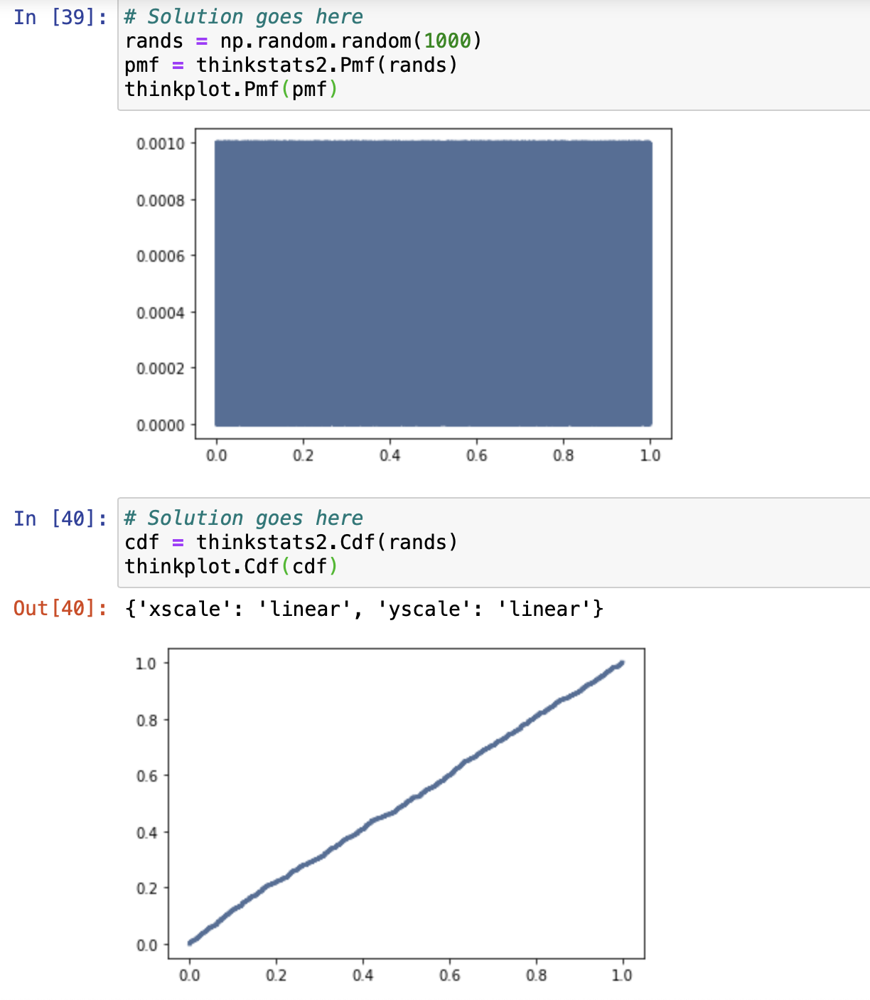

[Think Stats Chapter 4 Exercise 2](http://greenteapress.com/thinkstats2/html/thinkstats2005.html#toc41) (a random distribution)

Using `numpy.random.random` to generate 1000 random floats between 0.0 and 1.0, we get the following PMF and CDF plots:

The PMF looks uniform and the CDF is fairly linear, suggesting that the given function works as expected.
