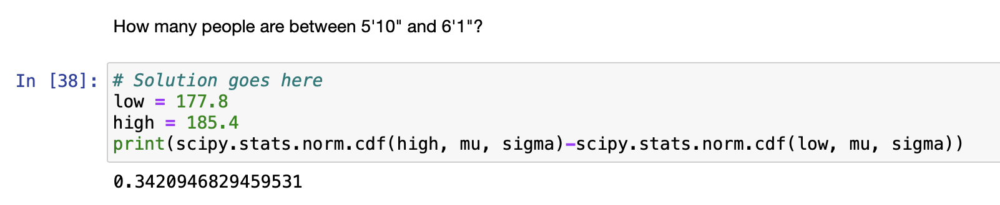

[Think Stats Chapter 5 Exercise 1](http://greenteapress.com/thinkstats2/html/thinkstats2006.html#toc50) (blue men)

We can take the difference between the percentile ranks of two numbers to determine the percentage of 
the distribution that lies between those two numbers. 

In this example, we use `scipy.stats.norm.cdf` to the percentile rank of 5 foot 10 inches among men's heights,
then we subtract that from the percentile for 6 foot 1, which tells us that `34.2%` of men fall between the
5 foot 10 inches and 6 foot 1 inch.

